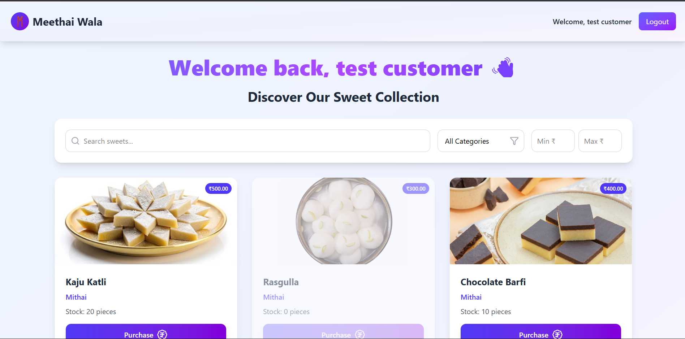

# 🍬 MethaiWala

## 📌 Project Description

**MethaiWala** is a full-stack **Sweet Shop Management System** built with **React (frontend)**, **Node.js + Express (backend)**, and **MySQL (database)**.

It allows:

* **Users** → to register, log in, browse sweets, and make purchases.
* **Shop Owners/Admins** → to manage their sweet shop, add/update/delete sweets, and track sales.

The project follows **Test-Driven Development (TDD)** with **Jest** for unit & API testing, ensuring reliability and maintainability.

## 🚀 Features

- User authentication (register, login)
- Sweet inventory management
- Purchase tracking
- Owner dashboard for shop management
- Responsive UI with React and Tailwind CSS
- API testing with Jest and Supertest
- JWT-based authentication
- CORS enabled for frontend-backend communication

## 🛠️ Tech Stack

- **Frontend**: React, Vite, Tailwind CSS, React Router, Axios
- **Backend**: Node.js, Express.js, MySQL2, JWT, bcrypt
- **Testing**: Jest, Vitest, Supertest
- **Database**: MySQL

## 📋 Prerequisites

Before running the project, ensure you have the following installed:

- Node.js (v14 or higher)
- MySQL Server
- npm or yarn

## 🔧 Setup and Installation

### Backend Setup

1. Navigate to the backend directory:
   ```bash
   cd backend
   ```

2. Install dependencies:
   ```bash
   npm install
   ```

3. Set up environment variables:
   Create a `.env` file in the `backend` directory with the following variables:
   ```
   PORT=5000
   DB_HOST=localhost
   DB_USER=your_mysql_username
   DB_PASSWORD=your_mysql_password
   DB_NAME=sweet_shop
   JWT_SECRET=your_jwt_secret_key
   ```

4. Set up the database:
   - Create a MySQL database named `sweet_shop`.
   - Import the SQL files from the `Dump20250917` directory to set up tables and dummy data.

5. Start the backend server:
   ```bash
   npm start
   ```
   The server will run on `http://localhost:5000`.

### Frontend Setup

1. Navigate to the frontend directory:
   ```bash
   cd front-end
   ```

2. Install dependencies:
   ```bash
   npm install
   ```

3. Start the development server:
   ```bash
   npm run dev
   ```
   The frontend will run on `http://localhost:5173` (default Vite port).

## 🧪 Testing

### Backend Tests

Run the backend tests:
```bash
cd backend
npm test
```

## Credential For Login

User or customer : 
Email : test@gmail.com
password: test@gmail.com

Owner or Admin :
Email : ramesh@sweets.com
password : hashed_password1

## 📊 Test Report

The backend test suite uses Jest and provides code coverage reports. The latest test results show:

- **Overall Coverage**: 88.6% Statements, 86.95% Branches, 94.11% Functions, 89.56% Lines
- **Backend Directory**: 92.3% Statements, 50% Branches, 50% Functions, 100% Lines
- **Controllers**: 82.89% Statements, 93.24% Branches, 100% Functions, 86.95% Lines
- **Middleware**: 83.33% Statements, 83.33% Branches, 100% Functions, 90% Lines
- **Routes**: 100% Statements, 100% Branches, 100% Functions, 100% Lines
- **Utils**: 100% Statements, 50% Branches, 100% Functions, 100% Lines

Detailed coverage reports are available in `backend/coverage/lcov-report/index.html`.

## 📸 Screenshots

### Test Report

### Welcome Page


### Login Page


### Dashboard

